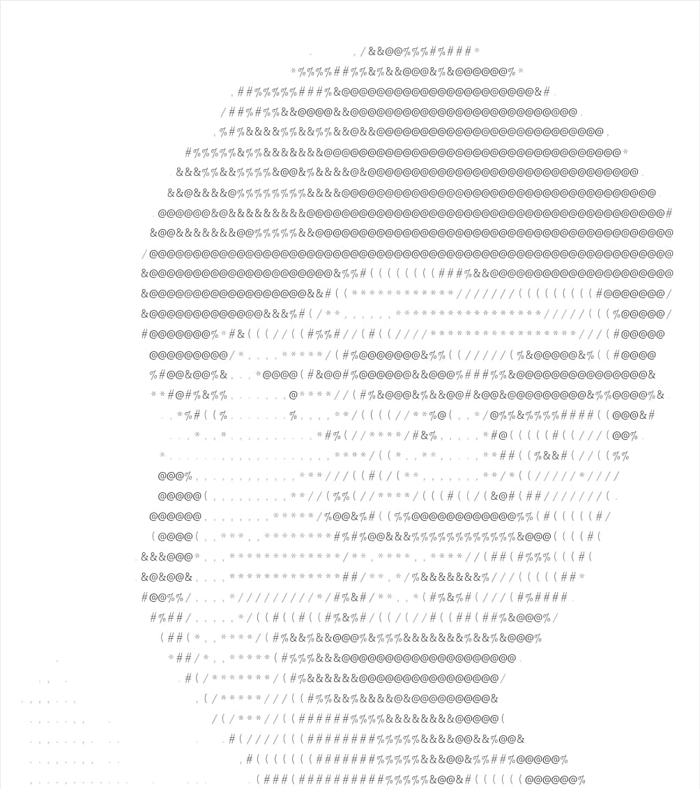

- 👋 Hi, I’m @JoshiAyush21
- Software Engineer with a proven track record in developing, architecting, and enhancing software across various platforms, including cloud technologies and machine learning. Expert in full-stack development, with extensive experience in C#, C++, .Net, JavaScript, TypeScript, SpringBoot, Angular, React, SQL/NoSQL. Demonstrated success in driving innovation through technology stack modernization and the implementation of microservices architecture. Holds a US Patent for ML-based pair programming concepts, showcasing a commitment to advancing code quality and development efficiency.
- 👀 I’m interested in ML applications on Code Generation/Understanding
<!---- 💞️ I’m looking to collaborate on ...--->
-  ✨ My AI/ML/NLP US patent  P/N 11113034 Smart programming assistant  https://image-ppubs.uspto.gov/dirsearch-public/print/downloadPdf/11113034
- 📫 How to reach me https://www.linkedin.com/in/ayush-joshi-205368145/

<!---
 
 --->
<!---
JoshiAyush21/JoshiAyush21 is a ✨ special ✨ repository because its `README.md` (this file) appears on your GitHub profile.
You can click the Preview link to take a look at your changes.
--->

 
 
  
   
 
   
     
     
       
   
            
         
         
          
          
          
          
          
          
          
          
         
         
 

 

 ##

 
       

 
         

         
     
